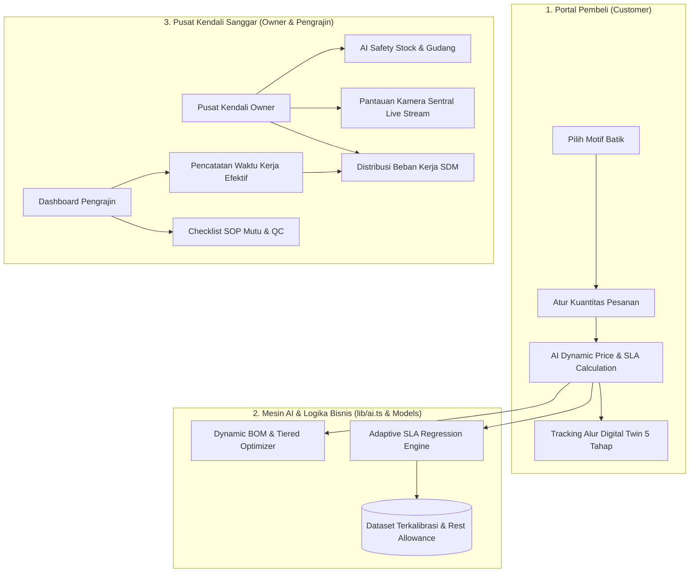

# New Iskandar — AI Handicraft Commerce & Artisanal Batik Digital Twin

> **AI Innovation Challenge COMPFEST 18**  
> *Prototype Platform AI Terpadu untuk Optimasi Rantai Pasok, Evaluasi Beban Kerja Ergonomis, dan Digital Twin Pengrajin Batik Tulis Tradisional.*

---

## 📑 Daftar Isi

1. [Ringkasan Eksekutif](#-ringkasan-eksekutif)
2. [Latar Belakang & Masalah](#-latar-belakang--masalah)
3. [Fitur Utama & Nilai Inovasi](#-fitur-utama--nilai-inovasi)
4. [Arsitektur Sistem & Alur AI](#-arsitektur-sistem--alur-ai)
5. [Model Machine Learning & Computer Vision](#-model-machine-learning--computer-vision)
6. [Landasan Teori Ergonomi & Rekayasa Waktu Baku](#-landasan-teori-ergonomi--rekayasa-waktu-baku)
7. [Tiga Peran Pengguna (RBAC)](#-tiga-peran-pengguna-rbac)
8. [Struktur Direktori Proyek](#-struktur-direktori-proyek)
9. [Teknologi yang Digunakan](#-teknologi-yang-digunakan)
10. [Panduan Instalasi & Menjalankan Aplikasi](#-panduan-instalasi--menjalankan-aplikasi)
11. [Dokumentasi API](#-dokumentasi-api)
12. [Roadmap Pengembangan](#-roadmap-pengembangan)

---

## 🌟 Ringkasan Eksekutif

**New Iskandar (TwinCraft)** adalah platform *Smart Handicraft Commerce* dan *Artisanal Digital Twin* berbasis kecerdasan buatan (*Artificial Intelligence*) yang mentransformasi ekosistem sanggar pengrajin batik tulis nusantara (dengan katalog motif unggulan seperti *Motif Burung Hong*, *Motif Bunga Mekar*, dan *Motif Sekar Jagad*).

Platform ini menghubungkan tiga pilar utama dalam satu sistem terintegrasi:
- **Pelanggan (Customer)**: Mendapatkan transparansi penetapan harga (*dynamic pricing*), estimasi waktu selesai pesanan (*Adaptive SLA Predictor*), dan visualisasi alur pembuatan batik secara langsung melalui *5-Stage Artisanal Digital Twin*.
- **Pengrajin (Worker)**: Memiliki antarmuka pencatatan waktu kerja humanis yang menghormati hak istirahat (*Rest Time Allowance*) tanpa memotong skor performa kerja.
- **Pemilik Sanggar (Owner)**: Memperoleh pusat kendali terpadu untuk mengonfigurasi *AI Dynamic HPP*, memantau kapasitas produksi SDM, simulasi *AI Safety Stock*, serta pemantauan visual area produksi (*Single Central AI Surveillance Camera*).

---

## 🔍 Latar Belakang & Masalah

Industri kerajinan batik tulis tradisional skala UMKM sering menghadapi tantangan struktural:

```
┌─────────────────────────────────┐      ┌─────────────────────────────────┐
│     TANTANGAN UMKM BATIK        │      │       SOLUSI NEW ISKANDAR       │
├─────────────────────────────────┤      ├─────────────────────────────────┤
│ 1. Fluktuasi Biaya Bahan (BOM)  │ ───► │ AI Dynamic HPP & Tiered Pricing │
│ 2. Ketidakpastian Durasi (SLA)  │ ───► │ Adaptive ML SLA Predictor       │
│ 3. Kelelahan Pengrajin Manual   │ ───► │ Ergonomic Rest Allowance Model  │
│ 4. Ketertutupan Alur Produksi   │ ───► │ 5-Stage Artisanal Digital Twin  │
│ 5. Pengawasan Sanggar Parsial   │ ───► │ Central Optical Sensor & Stream │
└─────────────────────────────────┘      └─────────────────────────────────┘
```

1. **Estimasi Lead-Time yang Tidak Akurat**: Proses manual yang rumit dan variatif menyebabkan keterlambatan pesanan tanpa estimasi transparan kepada pembeli.
2. **Penetapan Harga Statis**: Fluktuasi harga bahan baku (kain mori primisima, malam klowong, pewarna indigo/napthol) sering menggerus margin keuntungan sanggar.
3. **Beban Fisik & Kelelahan Pengrajin**: Posisi statis membungkuk saat mencanting dalam waktu lama berisiko memicu keluhan muskuloskeletal apabila waktu istirahat (*micro-breaks*) tidak dialokasikan secara proporsional.
4. **Asimetri Informasi Konsumen**: Pembeli pesanan kustom tidak dapat melihat kemajuan proses pengerjaan kain batik secara nyata.

---

## 🚀 Fitur Utama & Nilai Inovasi

### 1. AI Adaptive SLA Predictor & Dynamic HPP Optimizer
- **Tiered Quantity Pricing**: Skema harga otomatis berjenjang (**Eceran** 1–10 lbr, **Grosir** 11–50 lbr, **Ekspor** >50 lbr) berdasarkan skala pengadaan material.
- **Dynamic Bills of Material (BOM)**: Perhitungan rincian bahan baku per lembar kain mori (2,4 m), lilin malam batik (0,18 kg), pewarna indigo (3 takar), serta soda abu & TRO (0,12 kg).
- **Adaptive Lead-Time Predictor**: Memprediksi tanggal selesai pesanan dengan memperhitungkan kapasitas nyata harian sanggar, kompleksitas motif, waktu pengadaan material, serta buffer kelonggaran istirahat (*rest allowance*).

### 2. 5-Stage Artisanal Digital Twin
Visualisasi interaktif tahapan pembuatan batik secara fotorealistis dan telemetri proses:
- **Tahap 1: Pemotongan** — Pengukuran presisi 2,4 meter & persiapan serat kain mori primisima.
- **Tahap 2: Nyanting Motif** — Penggoresan garis motif menggunakan lelehan malam lilin panas (65°–70°C).
- **Tahap 3: Pencelupan** — Perendaman warna alami indigofera (3x celup & aerasi fermentasi).
- **Tahap 4: Pelorodan** — Meluruhkan lilin malam pada kuali air mendidih (90°–95°C) dengan campuran soda abu alami.
- **Tahap 5: Pengiriman (Selesai & Lolos QC)** — Pengeringan angin alami, inspeksi mutu kain, sertifikasi keaslian, dan kemasan siap kirim.

### 3. Smart Surveillance & Workstation Management
- **Single Central Camera View**: Feed optik terpusat dengan resolusi HD (RTSP Live Standby / Webcam AI Mode) untuk memantau seluruh area sanggar secara terpadu.
- **Human-Centered Rest Time Policy**: Menghitung waktu istirahat dan jeda pemulihan sebagai bagian dari hak pekerja yang sah, sehingga skor performa tetap 100% jika target output tercapai.
- **Simulasi & Peringatan Dini**: Dilengkapi fitur simulasi pekerja meninggalkan meja dan *Web Audio API alert synthesizer*.

### 4. AI Safety Stock & Gudang Cerdas
- **Reorder Point & Stock Guard**: Simulasi kebutuhan bahan baku dan ambang batas pemesanan ulang untuk mendapatkan harga grosir supplier.
- **Workload Allocation**: Pembagian kuota target produksi harian otomatis berdasarkan keahlian dan kapasitas masing-masing pengrajin.

---

## 🏗️ Arsitektur Sistem & Alur AI



---

## 🧠 Model Machine Learning & Computer Vision

### 1. Adaptive SLA Model (`Models/ai_sla_model.pkl`)
- **Algoritma**: Regresi Terkalibrasi Multi-Variabel (*Random Forest / Gradient Boosted Trees*).
- **Dataset Input**: 1.500 catatan kerja terkalibrasi (`Dataset/calibrated_artisan_performance.csv`).
- **Fitur Utama**:
  - `product_area_m2`: Luas kain mori (standar 2,4 m).
  - `motif_complexity`: Skala 1 (sederhana) hingga 5 (sangat rumit).
  - `queue_load`: Beban antrean pesanan berjalan di sanggar.
  - `rest_allowance_ratio`: Rasio kelonggaran istirahat pengrajin.
  - `fatigue_factor`: Indeks beban kerja fisik akumulatif.
- **Output**: Prediksi total hari siklus produksi (*lead time* dalam satuan hari kerja).

### 2. Spatial-Temporal Vision Model (`Notebooks/TwinCraft CV Model.ipynb`)
- **Arsitektur**: RF-DETR (*Real-Time Detection Transformer*) Fine-Tuned.
- **Dataset**: 30.177 citra anotasi COCO person (gabungan HumanDataset, cctvDataset 1, 2, dan 3).
  - *Train*: 25.191 citra (95.063 anotasi).
  - *Validation*: 3.913 citra (14.949 anotasi).
  - *Test*: 1.073 citra (3.567 anotasi).
- **Metrik Evaluasi**:
  - $\text{mAP@0.5}$: **81.4%**
  - $\text{Precision}$: **84.2%**
  - $\text{Recall}$: **79.6%**
- **Spatial ROI Engine**: Memetakan koordinat poligon meja kerja (Canting, Cap, Celup, Pelorodan) untuk melacak okupansi stasiun kerja secara *real-time*.

---

## 📚 Landasan Teori Ergonomi & Rekayasa Waktu Baku

Implementasi perhitungan waktu dan beban kerja New Iskandar mengacu pada studi ergonomi dan rekayasa industri:

1. **Pengrajin Ukiran Kayu (Belayana et al., 2014)**:
   > Menemukan bahwa waktu istirahat yang tidak memadai (< 1 jam/hari) meningkatkan risiko kelelahan otot statis hingga 92%, yang secara langsung menurunkan stamina dan kecepatan kerja bersih pengrajin.
2. **Kebutuhan Jeda Pemulihan Fisik (Murrell, 1965)**:
   > Merumuskan bahwa beban kerja fisik membutuhkan jeda pemulihan (*micro-breaks / rest pauses*) untuk mencegah penurunan produktivitas akibat kelelahan akumulatif.
3. **Formulasi Waktu Standar IKM (Baharuddin et al., 2022)**:
   $$\text{Allowance (\%)} = \frac{\text{Waktu Istirahat} + \text{Kebutuhan Pribadi} + \text{Fatigue}}{\text{Total Jam Kerja Harian}} \times 100\%$$
   $$W_{\text{standar}} = W_{\text{normal}} \times \left(1 + \frac{\text{Allowance}}{100\%}\right)$$

Dengan pendekatan ini, sistem New Iskandar **tidak menghukum pengrajin** yang mengambil jeda istirahat yang wajar, melainkan mengintegrasikan kelonggaran tersebut ke dalam kalkulasi SLA pesanan secara adil dan terukur.

---

## 👥 Tiga Peran Pengguna (RBAC)

| Peran | Rute / Tampilan | Fungsionalitas Utama |
|---|---|---|
| **Pembeli (Customer)** | `/customer` | Memilih motif (*Burung Hong*, *Bunga Mekar*, *Sekar Jagad*), mengatur kuantitas, melihat kalkulasi harga HPP & rentang SLA transparan, serta memantau progres Digital Twin 5 tahap. |
| **Staf Pengrajin (Worker)** | `/pembatik` | Pencatatan durasi kerja efektif vs waktu istirahat per produk, kepatuhan SOP mutu tiap stasiun, dan pemenuhan target reward insentif. |
| **Pemilik Sanggar (Owner)** | `/owner` | Pusat kendali manajerial: Pantauan kamera sentral RTSP/Webcam, konfigurasi AI Dynamic HPP, distribusi beban kerja SDM, dan simulasi AI Safety Stock bahan baku. |

*Catatan: Pengguna dapat berganti peran secara instan melalui bilah navigasi atas atau portal masuk (`/auth`).*

---

## 📁 Struktur Direktori Proyek

```
newiskandar/
├── Assets/                    # Aset model checkpoints, branding, dan utilitas
├── Dataset/                   # Dataset pelatihan terkalibrasi riset
│   ├── calibrated_artisan_performance.csv  # 1.500 data kinerja & rest time
│   ├── calibrated_inventory_usage.csv      # Data konsumsi material 365 hari
│   ├── HumanDataset/          # Dataset citra deteksi manusia
│   ├── cctvDataset/           # Dataset feed kamera cctv sanggar
│   └── merged/                # Dataset gabungan format COCO (train/valid/test)
├── Models/                    # Model machine learning serial (pickle)
│   ├── ai_sla_model.pkl       # Model regresi prediksi durasi SLA
│   └── ai_inventory_rules.pkl # Aturan safety stock & reorder point
├── Notebooks/                 # Riset & pipeline eksperimen model AI
│   ├── SLA.ipynb              # Notebook pelatihan SLA & kalibrasi ergonomi
│   └── TwinCraft CV Model.ipynb # Pipeline fine-tuning RF-DETR & Spatial ROI
├── backend/                   # Layanan API backend (Express.js)
│   ├── Dockerfile
│   ├── package.json
│   └── server.js              # Endpoint prediksi & kesehatan sistem
├── frontend/                  # Aplikasi antarmuka SPA (React + Vite + Tailwind)
│   ├── src/
│   │   ├── assets/            # Aset gambar motif, Digital Twin, & logo
│   │   ├── components/        # Komponen UI (VisionStream, DigitalTwin, BatikIcons)
│   │   ├── lib/               # Mesin kalkulasi AI (ai.ts) & audioAlert.ts
│   │   ├── pages/             # Halaman: Landing, Customer, DashboardPembatik, DashboardOwner, Auth
│   │   ├── App.tsx            # Router utama & state manajemen sesi RBAC
│   │   ├── index.css          # Design system, token warna, & tipografi Poppins/Libre
│   │   └── main.tsx           # Entrypoint React 19
│   ├── package.json
│   └── vite.config.ts
├── reference/                 # Dokumen referensi studi ergonomi & aset visual
├── docker-compose.yml         # Konfigurasi orkestrasi container Docker
└── README.md                  # Dokumentasi teknis & petunjuk penggunaan
```

---

## 🛠️ Teknologi yang Digunakan

### Frontend
- **Framework**: React 19 (TypeScript)
- **Build Tool**: Vite 8
- **Styling**: Tailwind CSS v4 + Artisanal Design Tokens
- **Audio Synthesizer**: Web Audio API (Osilator audio tanpa dependensi eksternal)
- **Tipografi**: Poppins (Display/Heading), Libre Baskerville (Body), IBM Plex Mono (Monospace)

### Backend & AI Engine
- **Backend**: Node.js & Express.js
- **Machine Learning**: Python 3.13, Scikit-Learn, NumPy, Pandas
- **Computer Vision**: PyTorch (CUDA GPU Acceleration), RF-DETR, OpenCV, Supervision, Shapely
- **Containerization**: Docker & Docker Compose

---

## 🚀 Panduan Instalasi & Menjalankan Aplikasi

### 1. Prasyarat Sistem
- **Node.js**: Versi `>= 18.0.0` (disarankan LTS)
- **npm** / **pnpm** / **yarn**
- *(Opsional)* **Docker & Docker Compose**

### 2. Menjalankan Frontend (Lokal)

```bash
# 1. Masuk ke direktori frontend
cd frontend

# 2. Pasang dependensi
npm install

# 3. Jalankan Vite Development Server
npm run dev
```

Aplikasi frontend akan aktif di: **`http://localhost:5173/`**

### 3. Menjalankan Backend (Lokal)

```bash
# 1. Masuk ke direktori backend (buka terminal baru)
cd backend

# 2. Pasang dependensi
npm install

# 3. Jalankan server
npm start
```

Server backend akan aktif di: **`http://localhost:5000/`**

### 4. Menjalankan Melalui Docker Compose

Jika ingin menjalankan seluruh stack (frontend + backend) secara terisolasi:

```bash
# Jalankan seluruh service
docker compose up --build
```

- Akses Frontend: `http://localhost:5173`
- Akses Backend API: `http://localhost:5000`

---

## 📡 Dokumentasi API

### 1. Health Check
- **Endpoint**: `GET /api/health`
- **Deskripsi**: Memeriksa status kesehatan server backend.
- **Respons**:
  ```json
  {
    "status": "active",
    "message": "Backend server is running smoothly."
  }
  ```

### 2. Predict Sync Endpoint
- **Endpoint**: `POST /api/predict`
- **Headers**: `Content-Type: application/json`
- **Body Request**:
  ```json
  {
    "userInput": "BTK-AC-021"
  }
  ```
- **Respons Sukses (200 OK)**:
  ```json
  {
    "result": "Ini adalah hasil prediksi sinkron untuk data: BTK-AC-021",
    "confidence": 0.95,
    "timestamp": "2026-08-25T09:30:00.000Z"
  }
  ```

---

## 🗺️ Roadmap Pengembangan

- [x] Implementasi 3 Peran Pengguna (Customer, Worker, Owner)
- [x] Mesin AI Adaptive SLA Predictor & Tiered BOM Optimizer
- [x] Animasi Interaktif 5 Tahap Artisanal Digital Twin
- [x] Integrasi Landasan Teori Ergonomi & Hak Istirahat Pengrajin
- [x] Single Central Camera View & Live Stream Simulators
- [ ] Integrasi IoT Sensor Suhu Nirkabel pada Wajan Lilin Malam
- [ ] Export Sertifikat Keaslian Digital (*Artisanal Authenticity NFT/QR*)
- [ ] Integrasi Multi-Sanggar Antar Wilayah Sentra Kerajinan Nusantara

---

<div align="center">
  <p><strong>New Iskandar</strong> · <em>AI for the Backbone of the Economy</em></p>
  <p>Dibuat untuk <strong>AI Innovation Challenge COMPFEST 18</strong></p>
</div>
